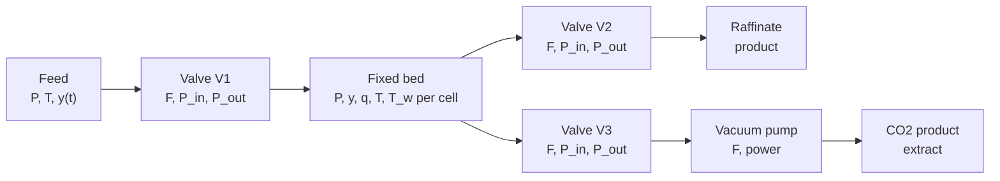

# Mocca as a modular, differentiable process simulator

*Architecture proposal — draft for discussion. 25 September 2026. Based on Mocca.jl `main` at v0.1.0 (commit `70f6cd6`) and Jutul 0.4.31.*

Mocca simulates one fixed-bed adsorption column today. This proposal restructures it into a set of unit models — fixed, moving, rotating and fluidised beds, membranes, solvent absorbers, and equipment such as valves, pumps and compressors — that connect into a flowsheet through Jutul `MultiModel`. The whole flowsheet stays differentiable.

## What changes

- **One set of equations for every unit.** Each unit supplies the source terms and fluxes that are specific to it.
- **Units connect through ports.** Boundary conditions that currently describe the feed or vacuum pump become separate device models, and a cycle becomes a schedule of valve openings and set-points.
- **All tunable quantities become Jutul parameters or forces**, so the adjoint can compute gradients for them.
- **Existing work is kept.** The isotherm and mass-transfer interfaces, the membrane `MultiModel` prototype and the regression tests carry over, and single-column simulations keep working.

## 1. Starting point

The proposal builds on three pieces of existing work: the fixed-bed code on `main`, the `MultiModel` membrane prototype on `claude/membrane-unit-modeling-0178f3`, and the mass and energy balance functions on `copilot/setup-mass-energy-balance-functions`.

### Worth keeping as it is

- **Swappable physics objects.** `AbstractIsotherm` and `AbstractMassTransfer` are small interfaces held as type parameters on the system, so any implementation can be plugged in and still works with automatic differentiation (AD).
- **Structs generic in `RealT`.** This is what lets the current `DictOptimization` example differentiate through case setup.
- **The membrane branch's base types.** It adds a `MoccaSystem`/`MoccaModel` supertype, `AbstractPermeanceModel` and `AbstractReactionModel`, and the first `MultiModel` in the codebase. That model couples a tube and a shell side through `AdditiveCrossTerm`s with `CTSkewSymmetry`, which applies one computed flux with opposite signs to both sides.

### What blocks a multi-unit simulator

1. **The equations are specific to one reactor.** The `:ComponentMasses` residual in `src/equations/flow/flow.jl` has the `V·∂q/∂t` sorption term written into it, so each new reactor would need its own copy of the equation.
2. **Boundary conditions also describe the neighbouring equipment.** `PressurisationBC`, `EvacuationBC` and the others are tied to cell 1 and cell N and include the feed or vacuum pump's behaviour. Two units can't be connected this way.
3. **Some values bypass the parameter system, so the adjoint can't compute gradients for them.** The boundary conditions read `fluid_viscosity`, `permeability`, `r_in` and `ambient_temperature` directly from `model.data_domain`. `FluidDensity` is also a constant, although the gas is modelled as ideal.
4. **The `Column()` entity name assumes a column.**

## 2. Layers

Code depends only on the layers below it. `L1`, `L3`, `L4` and `L5` are new; `L0` and `L2` reorganise existing code.

| Layer | Directory | Contents |
|---|---|---|
| L5 | `process/` | Cycle schedules, cyclic steady state (CSS), performance metrics, objectives, optimisation |
| L4 | `flowsheet/` | Build a `Jutul.MultiModel` from a flowsheet, `connect!`, per-unit state and parameter setup |
| L3 | `coupling/` | Ports, cross terms for streams and interfaces, counter-current pairing |
| L2 | `units/` | Fixed, moving, rotating and fluidised beds, membrane, absorber, equipment |
| L1 | `blocks/` | Reusable sets of variables, fluxes and source terms: gas flow, sorbent, wall energy, solid advection, liquid flow |
| L0 | `physics/`, `thermo/` | Pure functions dispatched on physics objects: isotherms, LDF, permeance, kinetics, equation of state (EOS), Ergun, dispersion and heat-transfer correlations |

Proposed `src/` layout: `core/` (system hierarchy, entities, traits, conservation-law skeleton, convergence), `thermo/`, `physics/{isotherms, mass_transfer, permeance, reactions, gas_liquid, transport}`, `blocks/`, `units/<type>/`, `coupling/`, `flowsheet/`, `process/`, `io/`. Plotting moves into a Makie package extension, so `CairoMakie` no longer loads with every `using Mocca`.

## 3. System type hierarchy

Every unit is a Jutul `SimulationModel` whose system sits in one abstract hierarchy:

```julia
abstract type MoccaSystem     <: Jutul.JutulSystem end   # from the membrane branch
abstract type DistributedUnit <: MoccaSystem end          # has a mesh and solves PDEs
abstract type SorbentBed      <: DistributedUnit end      # gas + sorbent in the same cell
abstract type FlowChannel     <: DistributedUnit end      # one side of a two-channel device
abstract type LumpedUnit      <: MoccaSystem end          # 0D with holdup: tank, node, flash drum
abstract type FlowElement     <: MoccaSystem end          # no holdup: valve, pump, compressor, vacuum pump
abstract type BoundaryUnit    <: MoccaSystem end          # feed, product, ambient

struct FixedBed{N,R,Iso,MT,Th,Mom,Eos} <: SorbentBed  end   # today's AdsorptionSystem
struct MovingBed{...}                  <: SorbentBed  end
struct RotatingBed{...}                <: SorbentBed  end
struct FluidisedBed{...}               <: SorbentBed  end   # bubble and emulsion regions
struct GasChannel{Side,...}            <: FlowChannel end   # membrane tube/shell, absorber gas side
struct LiquidChannel{...}              <: FlowChannel end   # absorber or stripper solvent side
```

Physics choices are made by passing objects into the system, not by creating subclasses:

| Choice | Options |
|---|---|
| Isotherm, mass transfer | Existing types, plus GAB from `fran/isotherm_updates` |
| `thermal` | `Isothermal`, `Adiabatic`, `WithWall` |
| `momentum` | `Darcy`, `Ergun` |
| `eos` | `IdealGas` now; Peng–Robinson later for compression and dense-phase CO₂ |
| `reaction`, `permeance`, `film_model` | Existing reaction and permeance types; a gas–liquid film model for the absorber |

Small trait functions such as `has_energy(sys)`, `has_wall(sys)`, `solid_is_mobile(sys)` and `has_liquid(sys)` drive the `select_*!` functions. The traits decide which variables and equations exist. The update code for each variable is written once, on the broadest model type it applies to, usually `MoccaModel`.

Jutul's `CompositeSystem` was considered and isn't recommended. Gas and sorbent are tightly coupled inside each cell, and splitting them into namespaced sub-systems adds complexity without benefit.

## 4. Sharing functions

This is the core refactor. Every distributed unit uses one conservation-law residual, and each unit type supplies a tuple of source terms and fluxes:

```julia
# generic, written once for every DistributedUnit:
R_i = ∂M_i/∂t + ∇·F_i − Σ_s source(s, sys, state, state0, cell, i, Δt)

mass_sources(::FixedBed)    = (SorptionUptake(),)
mass_sources(::GasChannel)  = (ReactionSource(),)     # NoReaction drops out at compile time
energy_sources(::FixedBed)  = (HeatOfSorption(), PressureWork(), WallExchange())
flux_model(::MovingBed)     = (GasAdvectionDispersion(), SolidAdvection())
```

The membrane branch's `reaction_mass_source` already does this in a small way; this generalises it. The type of the source-term tuple is known at compile time, so the loop over it is type-stable and costs nothing at runtime.

### Where each function is defined

| Level | Dispatches on | Examples |
|---|---|---|
| Physics functions | Physics object | `compute_equilibrium`, `compute_mass_transfer_rate`, `compute_permeate_flux`, EOS, Ergun |
| Secondary variables | `MoccaModel` or trait | `TotalMolarConcentration`, `MolarConcentration`, `AverageMolarMass`, `C_pg`, gas density |
| Blocks | Source or flux type | `SorptionUptake`, `WallExchange`, `SolidAdvection`, `GasAdvectionDispersion` |
| Unit-specific | Concrete system | Rotating-bed sector geometry, fluidised-bed bubble correlations |
| Cross terms | Cross-term type | `StreamCT`, `PermeationCT`, `FilmTransferCT`, `HeatExchangeCT`, `SolidsTransferCT` |

### Which blocks each reactor reuses

| Block | Fixed | Moving | Rotating | Fluidised | Membrane | Absorber | Equipment |
|---|---|---|---|---|---|---|---|
| 1D gas flow (Darcy/Ergun + dispersion) | ● | ● | ● axial | ● per region | ● each side | ● gas side | – |
| Sorbent loading (isotherm + LDF) | ● | ● | ● | ● | – | – | – |
| Solid advection | – | ● axial | ● angular | ● loop | – | – | – |
| Wall energy | ● | opt | opt | opt | opt | opt | – |
| 1D liquid flow | – | – | – | – | – | ● | ● pump |
| Interface cross term | – | – | – | ● bubble ↔ emulsion | ● permeation | ● gas–liquid film | – |
| Reactions | opt | opt | opt | opt | opt | ● amine kinetics | – |
| Ports and streams | ● | ● | ● sectors | ● | ● | ● | ● |

- **Rotating bed:** a 2D mesh (axial × angle). The solid moves through the angle using the moving-bed advection block, and each sector boundary is a port. This avoids time-switching the boundary conditions.
- **Two-channel devices:** the membrane, the absorber and a heat exchanger all use the tube/shell pattern from the membrane branch. One helper covers them: `counter_current_pair(sysA, sysB, interface_cts; ncells)`.

## 5. Coupling units: ports and streams

Units with holdup (beds, tanks, nodes, boundaries) own the pressure. Flow elements (valves, pumps, compressors, vacuum pumps, pipes) own the molar flow and solve a device law. Each connection between a port and a device is a pair of `AdditiveCrossTerm`s. This is the same pattern JutulDarcy uses to couple wells to the reservoir.

Example: the current single-bed, four-stage VSA as a flowsheet.



Each stage is a schedule of valve openings on V1–V3 and set-points on the boundaries, so nothing inside the bed changes between stages. `F` can change sign; composition and enthalpy are upwinded.

- **Ports.** Each unit declares named ports with `ports(model)`. A fixed bed has `(bottom = Port(cells=[1]), top = Port(cells=[nc]))`.
- **Device laws.** A flow element has `F`, `P_in` and `P_out` as unknowns.
  - Valve: `F = Cv·x(t)·g(ΔP)`, with `g` smoothed near zero.
  - Compressor: isentropic efficiency, with power as an output variable.
- **The two cross terms in each connection.** One adds the flow (±F·y and ±F·h) to the unit's mass and energy equations. The other feeds the unit's port-cell pressure into the device's `P_in − P_port = 0` equation.
- **Stream types.** Gas, liquid and solid streams. Solid streams carry loading and temperature, which moving beds and circulating fluidised beds need.
- **Cycles become schedules.** Valve openings and feed or vacuum set-points are forces on the device models, not boundary conditions on the bed. Two-bed systems with pressure equalisation, which can't be built today, become a matter of wiring.
- **Single-unit mode stays.** The existing BCs move to `units/fixed_bed/legacy_bcs.jl` as a `PrescribedBoundary` mode, so the current examples and `test/regression/` keep working. A `PrescribedPressureSource` with the exponential ramp reproduces them exactly in flowsheet mode.

## 6. Differentiability rules

These rules are enforced in review and in tests.

1. **Anything tunable is a Jutul parameter** on a `Unit()` entity (renamed from `Column()`), or a force that can be vectorised. Nothing is read from `data_domain` inside residuals, boundary conditions or cross terms.
2. **Coefficients inside physics objects**, such as isotherm constants, are differentiated through setup with `DictOptimization`. They stay generic in `RealT` and are never typed as `Float64`.
3. **No non-smooth operations on state**, such as `max`, `abs` or `if` on pressure or flow. Use smoothed versions. Upwinding is the one accepted exception.
4. **Forces implement `vectorize_force!` and `devectorize_force`**, which makes schedules and set-points optimisable. `MultiModel` already supports `vectorize_forces`.
5. **Differentiable cyclic steady state (CSS).** Treat CSS as a fixed point `x₀ = Φ(x₀, p)`.
   - Solve it by successive substitution with Anderson acceleration.
   - Get the gradient with the implicit function theorem: an adjoint over one cycle, then a linear solve with `(I − ∂Φ/∂x₀)ᵀ`.
   - To check first: this needs the sensitivity with respect to `state0` from Jutul's adjoint.
6. **Gradient tests.** Every block and every cross term has a test comparing the AD gradient with a finite-difference gradient.

## 7. CCS-specific scope

The target is the carbon capture and storage chain: capture, then conditioning and compression. That adds:

- a component database covering CO₂, N₂, H₂O, O₂, Ar and SO₂;
- water co-adsorption for humid flue gas and direct air capture;
- a real-gas EOS for the compression and transport steps;
- process metrics in `process/`, computed from port streams and device power: purity, recovery, productivity, and specific energy in kWh per tonne of CO₂.

Specific energy needs pump and compressor models even for a pure VSA study, so equipment is worth adding early.

## 8. Migration phases

| Phase | Work | Done when |
|---|---|---|
| 0 | Merge `MoccaSystem` from the membrane branch. Rename `Column` to `Unit`. Move `data_domain` reads into parameters. Make gas density a secondary variable. | Regression tests pass |
| 1 | Generic conservation-law skeleton with source-term tuples. Move the fixed bed onto it. Add thermal and momentum options. | Regression results match to tolerance |
| 2 | Ports, `StreamCT`, and Feed, Product, Valve and VacuumPump models. Build the four-stage VSA as a flowsheet. | Flowsheet VSA matches the legacy BCs |
| 3 | Rebase the membrane onto the framework using `counter_current_pair`. Add a two-bed VSA with pressure equalisation. Port the balance functions. | Membrane tests pass; mass and energy balance closes |
| 4 | CSS solver, differentiable CSS, metrics and objectives. Update `examples/optimization.jl`. | CSS gradient matches finite differences |
| 5 | Moving, rotating and fluidised beds, solvent absorber and stripper, compressor, Peng–Robinson EOS. | One example and one gradient test per unit |

## 9. Open decisions

**Pressure–flow network or prescribed boundaries.**
Recommended: the pressure–flow network in section 5. It costs a few extra unknowns per device and needs smoothed valve laws, but it is the only option that allows units to be connected.

**How to make physics-object coefficients differentiable.**
Recommended: differentiate through setup with `DictOptimization`, which is simpler. Promoting the coefficients to Jutul parameters gives full adjoint coverage but makes the interface more complex.

**Fluidised-bed fidelity.**
A 0D well-mixed model is much less work than a 1D bubble/emulsion model. The right choice depends on which studies the fluidised bed has to support.

## Basis for this proposal

- Mocca.jl `main` at v0.1.0 (commit `70f6cd6`), and the feature branches named above.
- Jutul APIs checked in the installed source (0.4.31): `MultiModel`, `AdditiveCrossTerm`, `CTSkewSymmetry`, `add_cross_term!`, `vectorize_forces` for `MultiModel`, `solve_adjoint_sensitivities`, `WrappedGlobalObjective`, `CompositeSystem`.
- Not yet checked: support for sensitivities with respect to `state0`, which the CSS gradient in section 6 depends on.
